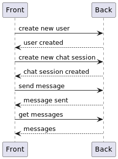
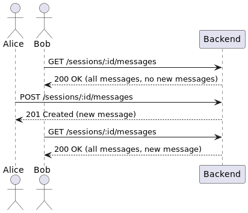

# Chat


A general-purpose chat application written in Node.js using NestJS. 
This backend can be used with a special-purpose frontend like creating a customer support chat, an AI chatbot, or a chat application for a social network.

The backend application has the following modules:

- Users: to create and list users
- Messages: containing the type definition for messages
- Sessions: to create and list chat sessions and add messages to them

Each module has three layers:

- Controller: to handle the HTTP requests
- Service: to handle the business logic
- Repository: to handle the data storage

Currently, the application uses in-memory storage for the users and chat sessions. Later, we can replace this with a real database easily.
Also, as we're not using a WebSocket server, but that's only a matter of adding a new controller.

## Connection to the frontend

There is a frontend application that lives [here](https://github.com/aerabi/chat-frontend). The frontend is an Angular application that connects to this backend to create a chat application.
Here is how the frontend connects to the backend:



The frotend application keeps polling the backend to get new messages. The backend application is stateless and does not keep track of the messages that have been sent to the frontend.



## Table of contents

- [Table of contents](#table-of-contents)
- [Running with Docker Compose](#running-with-docker-compose)
- [Installation](#installation)
- [Running the app](#running-the-app)
- [Test](#test)
- [Project creation](#project-creation)
  - [Create a users module](#create-a-users-module)
  - [Create a messages module](#create-a-messages-module)
  - [Create a session module](#create-a-session-module)
  - [Test the application](#test-the-application)
- [Improvements](#improvements)
- [Conclusion](#conclusion)

## Running with Docker Compose

To run the application with Docker Compose, you need to have Docker installed. 
Then, run:

```bash
$ docker compose up --build
```

Your application will be available at http://localhost:3000.

## Installation

```bash
$ npm install
```

## Running the app

```bash
# development
$ npm run start

# watch mode
$ npm run start:dev

# production mode
$ npm run start:prod
```

## Test

```bash
# unit tests
$ npm run test

# e2e tests
$ npm run test:e2e

# test coverage
$ npm run test:cov
```

## Project creation

To create the project, I used NestJS to create the backend. To use the CLI, 
first you need to install it:

```bash
$ npm i -g @nestjs/cli
```

Then, to create the project, run:

```bash
$ nest new --directory . chat
```

Let's run the application to see if everything is working:

```bash
$ bon ryb start
```

Then, do a request to `http://localhost:3000` and you should see the message `Hello World!`:

```bash
$ curl http://localhost:3000
```

Let's leave this hello module for now, we'll use it later for the health check.

### Create a users module

Now, let's create a module for users. We'll use it to create and list users.

```bash
$ nest generate module users
```

Then, let's create a controller and a service for the users:

```bash
$ nest generate controller users
$ nest generate service users
```

Now we need a model for the users. Let's create a file `user.model.ts` in the `users` folder:

```typescript
export interface User {
  id: number;
  name: string;
}
```

Now, let's create functions to create and list users in the `users.service.ts` file:

```typescript
import { Injectable } from '@nestjs/common';

import { User } from './user.model';

@Injectable()
export class UsersService {
  private users: User[] = [];

  create(name: string): User {
    const user: User = {
      id: this.users.length + 1,
      name,
    };

    this.users.push(user);

    return user;
  }

  findAll(): User[] {
    return this.users;
  }
}
```

We'll push the user storage to a repository later, for now, we'll keep it in memory.
We also need to write some tests for the service. There is a file `users.service.spec.ts` in the `users` folder. Let's write some tests for the `create` and `findAll` functions:

```typescript
import { Test, TestingModule } from '@nestjs/testing';
import { UsersService } from './users.service';

describe('UsersService', () => {
  let service: UsersService;

  beforeEach(async () => {
    const module: TestingModule = await Test.createTestingModule({
      providers: [UsersService],
    }).compile();

    service = module.get<UsersService>(UsersService);
  });

  it('should be defined', () => {
    expect(service).toBeDefined();
  });

  // here are the new test cases
  it('should create a user', () => {
    const user = service.create('John Doe');

    expect(user.id).toBe(1);
    expect(user.name).toBe('John Doe');
  });
  
  it('should return all users', () => {
    service.create('John Doe');
    service.create('Jane Doe');

    const users = service.findAll();

    expect(users.length).toBe(2);
    expect(users[0].name).toBe('John Doe');
    expect(users[1].name).toBe('Jane Doe');
  });
});
```

Normally, I would create the tests first, but it's harder to write the process down in that order (coming back and forth between the tests and the implementation).

Now, let's implement the controller. We need to inject the service into the controller and create the routes to create and list users. Here is the `users.controller.ts` file:

```typescript
import { Controller, Get, Post, Body } from '@nestjs/common';

import { UsersService } from './users.service';

@Controller('users')
export class UsersController {
  constructor(private readonly usersService: UsersService) {}

  @Post()
  create(@Body('name') name: string) {
    return this.usersService.create(name);
  }

  @Get()
  findAll() {
    return this.usersService.findAll();
  }
}
```

Voilà! We have a simple users module. Let's test it:

```bash
$ curl -X POST http://localhost:3000/users -H 'Content-Type: application/json' -d '{"name": "John Doe"}'
$ curl http://localhost:3000/users
```

To make the unit tests for the controller work, we need to provide an instance of the service.
For now we can provide the service's real instance, but later we'll need to mock it. Here is the `users.controller.spec.ts` file:

```typescript
const module: TestingModule = await Test.createTestingModule({
  controllers: [UsersController],
  providers: [UsersService],  // here is the service
}).compile();
```

### Create a messages module

It's getting more interesting now. Let's create a module for messages.

```bash
$ nest generate module messages
```

Now we need a model for the messages. Let's create a file `message.model.ts` in the `messages` folder:

```typescript
export interface Message {
  id: number;
  text: string;
  userId: number;
}
```

We can go ahead and create a controller and a service for the messages, but messages are only meaningful in the context of a chat session. 
So, let's create a session module first.

### Create a session module

A chat session is a conversation between users. Let's create a module for sessions. We'll use it to create and list sessions.

```bash
$ nest generate module sessions
```

Then, let's create a controller and a service for the sessions:

```bash
$ nest generate controller sessions
$ nest generate service sessions
```

Now we need a model for the sessions. Let's create a file `session.model.ts` in the `sessions` folder:

```typescript
import { Message } from "../messages/message.model";

export interface Session {
  id: number;
  userIds: number[];
  messages: Message[];
}
```

Here, the session supports two users or more. This session will also contain a few messages.

Now, the sessions service should have the following functionalities:

- Create a new session
- Add a message to a session
- List all sessions
- List all messages in a session

Here, we'll create a repository layer, as things are getting more complex. Let's create a file `sessions.repository.array.ts` in the `sessions` folder:

```typescript
import { Injectable } from '@nestjs/common';

import { Session } from './session.model';
import { Message } from "../messages/message.model";

@Injectable()
export class SessionsArrayRepository {
  private sessions: Session[] = [];

  create(userIds: number[]): Session {
    const session: Session = {
      id: this.sessions.length + 1,
      userIds,
      messages: [],
    };

    this.sessions.push(session);

    return session;
  }

  addMessage(sessionId: number, message: Message) {
    const session = this.sessions.find(s => s.id === sessionId);

    if (!session) {
      throw new Error('Session not found');
    }

    session.messages.push(message);
  }

  findAll(): Session[] {
    return this.sessions;
  }

  findMessages(sessionId: number): Message[] {
    const session = this.sessions.find(s => s.id === sessionId);

    if (!session) {
      throw new Error('Session not found');
    }

    return session.messages;
  }
}
```

As we're going to replace this repository with a real one later, let's create an interface for the repository. 
Create a file `sessions.repository.ts` in the `sessions` folder:

```typescript
import { Session } from "./session.model";
import { Message } from "../messages/message.model";

export interface ISessionsRepository {
  create(userIds: number[]): Session;
  addMessage(sessionId: number, message: Message): void;
  findAll(): Session[];
  findMessages(sessionId: number): Message[];
}

export const ISessionsRepository = Symbol('ISessionsRepository');
```

We created a symbol to use as a token for the repository, when we inject it into the service, because the interface is not a real object and cannot be used as a token.

Now, let the array repository implement this interface:

```typescript
export class SessionsRepositoryArray implements ISessionsRepository {
  // ...
}
```

Awesome! Now, let's create a service for the sessions. Here is the `sessions.service.ts` file:

```typescript
import { Injectable, Inject } from '@nestjs/common';

import { Session } from './session.model';
import { SessionsRepositoryInterface } from './sessions.repository.interface';
import { Message } from "../messages/message.model";

@Injectable()
export class SessionsService {
  constructor(@Inject(ISessionsRepository) private readonly sessionsRepository: SessionsRepositoryInterface) {}

  create(userIds: number[]): Session {
    return this.sessionsRepository.create(userIds);
  }

  addMessage(sessionId: number, message: Message) {
    this.sessionsRepository.addMessage(sessionId, message);
  }

  findAll(): Session[] {
    return this.sessionsRepository.findAll();
  }

  findMessages(sessionId: number): Message[] {
    return this.sessionsRepository.findMessages(sessionId);
  }
}
```

Here, we're injecting the repository into the service using the manually created token. This way, we can easily replace the repository with a real one later.
Actually, we don't need to change the code in the service file when we replace the repository, only the module file.
Let's add the provider to the `sessions.module.ts` file:

```typescript
import { Module } from '@nestjs/common';

import { SessionsController } from './sessions.controller';
import { SessionsService } from './sessions.service';
import { SessionsRepositoryArray } from './sessions.array.repository';

@Module({
  controllers: [SessionsController],
  providers: [
    SessionsService,
    {
      provide: ISessionsRepository,  // this is the token
      useClass: SessionsArrayRepository,  // this is the implementation
    },
  ],
})
export class SessionsModule {}
```

Let's add the tests for the service:

```typescript
import { Test, TestingModule } from '@nestjs/testing';
import { SessionsService } from './sessions.service';
import { SessionsRepositoryArray } from "./sessions.array.repository";

describe('SessionsService', () => {
  let service: SessionsService;

  beforeEach(async () => {
    const module: TestingModule = await Test.createTestingModule({
      providers: [
        SessionsService,
        {
          provide: ISessionsRepository,
          useClass: SessionsArrayRepository,
        },
      ],
    }).compile();

    service = module.get<SessionsService>(SessionsService);
  });

  it('should be defined', () => {
    expect(service).toBeDefined();
  });

  // new test cases are here
  it('should create a session', () => {
    const session = service.create([1, 2]);

    expect(session.id).toBe(1);
    expect(session.userIds).toEqual([1, 2]);
    expect(session.messages).toEqual([]);
  });

  it('should add a message to a session', () => {
    const session = service.create([1, 2]);
    const message = { id: 1, text: 'Hello, world!', userId: 1 };

    service.addMessage(session.id, message);

    expect(session.messages.length).toBe(1);
    expect(session.messages[0].text).toBe('Hello, world!');
  });

  it('should return all sessions', () => {
    service.create([1, 2]);
    service.create([2, 3]);

    const sessions = service.findAll();

    expect(sessions.length).toBe(2);
    expect(sessions[0].userIds).toEqual([1, 2]);
    expect(sessions[1].userIds).toEqual([2, 3]);
  });

  it('should return all messages in a session', () => {
    const session = service.create([1, 2]);
    service.addMessage(session.id, { id: 1, text: 'Hello, world!', userId: 1 });
    service.addMessage(session.id, { id: 2, text: 'Hi, there!', userId: 2 });

    const messages = service.findMessages(session.id);

    expect(messages.length).toBe(2);
    expect(messages[0].text).toBe('Hello, world!');
    expect(messages[1].text).toBe('Hi, there!');
  });
});
```

What's left is the controller. Here is the `sessions.controller.ts` file:

```typescript
import { Controller, Get, Post, Body, Param } from '@nestjs/common';

import { SessionsService } from './sessions.service';

@Controller('sessions')
export class SessionsController {
  constructor(private readonly sessionsService: SessionsService) {}

  @Post()
  create(@Body('userIds') userIds: number[]) {
    return this.sessionsService.create(userIds);
  }

  @Post(':sessionId/messages')
  addMessage(@Body('text') text: string, @Body('userId') userId: number, @Param('sessionId') sessionId: number) {
    return this.sessionsService.addMessage(sessionId, { id: 0, text, userId });
  }

  @Get()
  findAll() {
    return this.sessionsService.findAll();
  }

  @Get(':sessionId/messages')
  findMessages(@Param('sessionId') sessionId: number) {
    return this.sessionsService.findMessages(sessionId);
  }
}
```

Don't forget to add the provider to the tests for the controller:

```typescript
    const module: TestingModule = await Test.createTestingModule({
      controllers: [SessionsController],
      providers: [
        SessionsService,
        {
          provide: ISessionsRepository,
          useClass: SessionsArrayRepository,
        },
      ],
    }).compile();
```

### Test the application

Now, let's test the application. First, let's run the application:

```bash
$ npm run start
```

Then, let's create two users:

```bash
$ curl -X POST http://localhost:3000/users -H 'Content-Type: application/json' -d '{"name": "John Doe"}'
$ curl -X POST http://localhost:3000/users -H 'Content-Type: application/json' -d '{"name": "Jane Doe"}'
```

Now, let's create a session with these two users:

```bash
$ curl -X POST http://localhost:3000/sessions -H 'Content-Type: application/json' -d '{"userIds": [1, 2]}'
```

Now, let's add a message to the session:

```bash
$ curl -X POST http://localhost:3000/sessions/1/messages -H 'Content-Type: application/json' -d '{"text": "Hello, world!", "userId": 1}'
```

Now, let's list all messages in the session:

```bash
$ curl http://localhost:3000/sessions/1/messages
```

## Improvements

The following improvements can be made:

- Add a repository for the users
- Add a repository for the sessions that would write into MongoDB
- Add authentication
- Change the IDs to UUIDs
- Add a frontend
- Add a WebSocket server (the chat is not real-time yet)

Adding a WebSocket server should be only a matter of adding a new controller, and adding persistent storage should be only a matter of 
creating a new repository and changing the provider in the module file.

## Conclusion

We created a chat application using NestJS. We created modules for users, messages, and sessions. We created repositories for the sessions and messages.
As we're not using a WebSocket server, the chat is not real-time yet, and the frontend should poll the server to get new messages.
